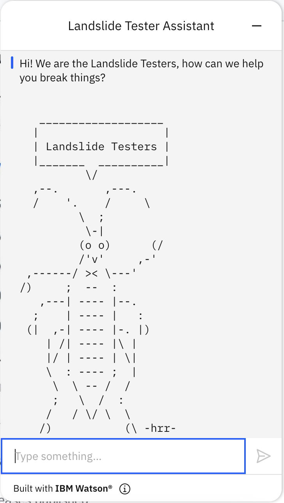
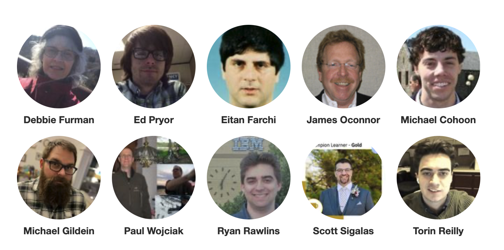

# Landslide Testers Challenge Project

### Unleashing the Power of AI-Driven Chatbot for Software Testers
 
## Agenda

* [Who are we?](#Team)
* [What did we make?](#Technology)
* [Why is it valuable?](#Value)
* [How is it innovative?](#Innovation)

## Team
 

- Debbie Furman <debbyt@us.ibm.com> (Lead)
- Eitan Farchi <farchi@il.ibm.com>
- Ed Pyror <ebpryor@us.ibm.com>
- James O’Connor <jimoconn@us.ibm.com>
- Michael Cohoon <mtcohoon@us.ibm.com>
- Michael Gildein <megildei@us.ibm.com>
- Paul Wojciak <wojciak@us.ibm.com>
- Ryan Rawlins <rrawlins@us.ibm.com>
- Scott Sigalas <ssigala@us.ibm.com>
- Torin Reilly <treilly@us.ibm.com>

## Technology
### AI infused chatbot to assist software testers
Via generative AI
- Automatically summarize the current list of testcases
- Automatically identify new testcases that are added between two commits
- Generate test variations and considerations
- Identify which files have changed
- Get information about the latest commit (author, message, date)

### Future 
- Generate test plan of source code for review
- Autodetect test directories in a repository
- Run testcases
- Analyze tests results
- Identify holes in test coverage
- Generate additional tests to increase coverage

## Value
- High quality software is paramount to our company and our clients
- Test domain specific skill takes significant amount of time to grow
- Understanding existing test assets non-trivial coverage in complex software is often intractable
- Open source has become ubiquitous with modern enterprise software development and even foundational open source projects have neglected code quality

## Innovation
- Capturing institutional knowledge without years to decades of test domain experience
- Reduce investigation time to find new tests and changes across commits
- Using commit information recommend the most important areas to test and how to test them
- Validate the description and details of a code change
